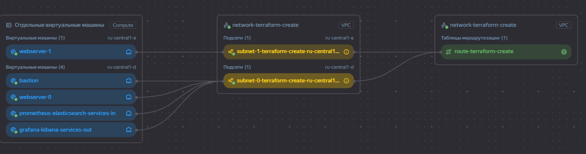
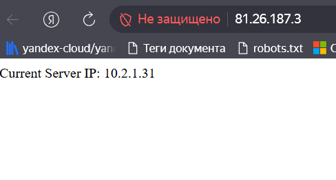
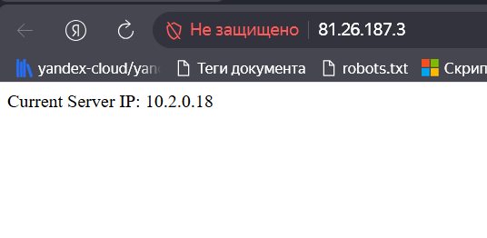
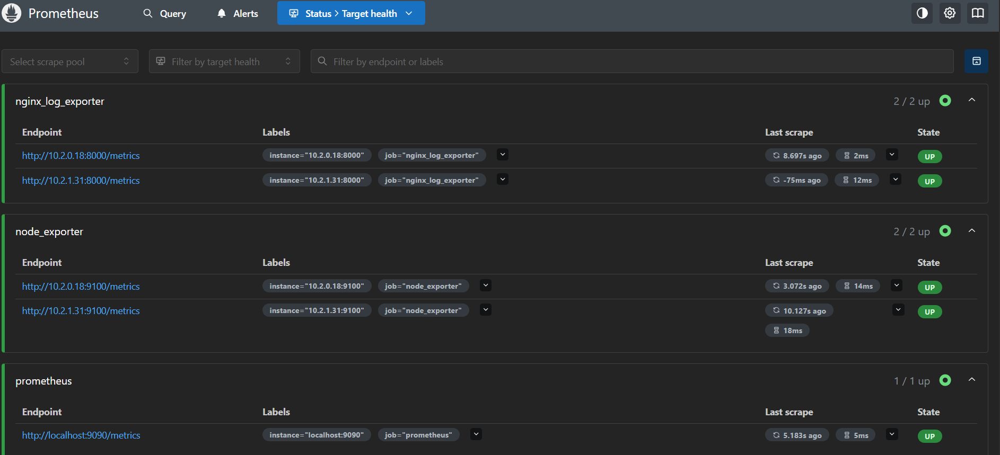
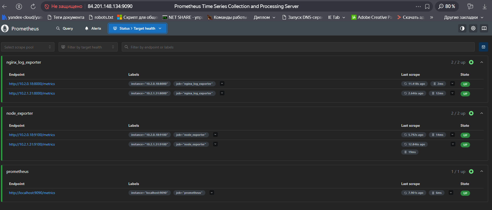
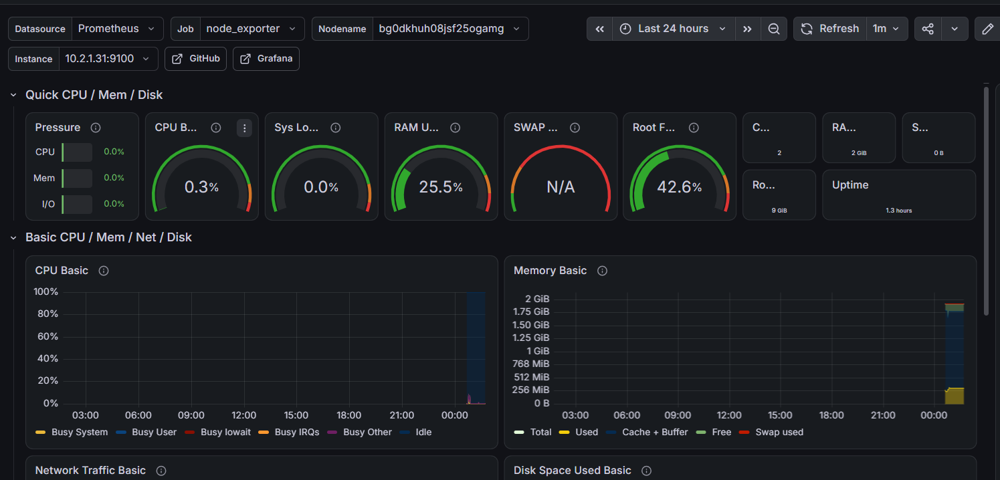
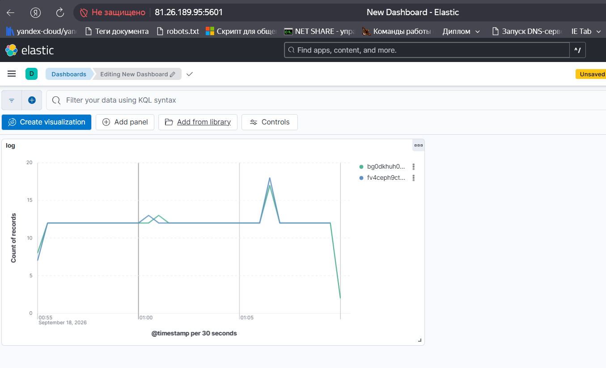

# Курсовой проект на профессии «DevOps-инженер с нуля» Чепелев Павел

  

 Проект состоит издвух основных директорий:

 terraform и ansible

  

 В директории terraform находятся файлы конфигурации среды для развертывания ее наоблаке yandex cloud

 providers.tf   - подключение к облаку

 network.tf     - создание сетевой инфраструктуры

 balancer.tf    - создание балансировщика для веб серверов

 vm.tf          - создание виртуальных машины (бастион, веб сервера, сервера с ввнешними и внутренними сервисами)

 variables.tf   - содержит переменные

 snapsshot.tf   - задание на создание снапшотов виртуальных машин

 cloud-init.yml - конфигурация создания общего пользователя на всех ВМ с ключом авторизации по ssh

  

Карта развернутой рабочей инфраструктуры

 

В дирректории ansible находятся файлы конфигурации по настройке подключения к виртуальным машинам на облаке

ansible.cfg - файл конфигураций самого ansible

host.ini - файл с информацией о  виртуальных машинах в обкаке и способе подключения к ним. Этот файл создается автоматически при развертывании инфраструктуры с помощью terraform. задание на создание файла находится в файле vm.tf `resource "local_file" "inventory"`

site.yml - конфигурационный файл в котором указано какие программы из дирректории playbook нужно установить на ВМ

В дирректории ansible/playbook находятся иерархия с файлами конфигураций для установки и настройки ПО на созданных виртуальных машинах. Каждая дирректория соответствует устанавливаемой программе, за исключением monitoring, от туда устанавливаются экспортеры для prometheus

ansible устанавливает все необходимое ПО посредством docker контейнеров. Данный способ выбран для упрощения установки и дальнейшей эксплуатации

Устанавливаемое ПО из playbook с иерархией по виртуальным машинам:
ВМ `webservers`:

- `nginx`: веб-сервер на котором автоматически создается html страница с ip адресом самой машины, для проверки работы балансировщика





- `monitoring`: node и nginx экспортеры для prometheus
  
- `filebeat`:  ПО для выгрузки логов nginx в elasticsearch


ВМ `services_in`:

- `Elasticsearch`: сборщик логов которые отправляют вебсервера

Доказательство работы: информация с порта 9200

```bash
agz@fv49knhmktdda2bklj7l:~$ curl http://10.2.0.22:9200/
{
  "name" : "fv4gpia8cnfhk263a8b1",
  "cluster_name" : "monitoring-cluster",
  "cluster_uuid" : "7y7PV4K7QNCdwkmTY7Y42A",
  "version" : {
    "number" : "8.15.0",
    "build_flavor" : "default",
    "build_type" : "docker",
    "build_hash" : "1a77947f34deddb41af25e6f0ddb8e830159c179",
    "build_date" : "2024-08-05T10:05:34.233336849Z",
    "build_snapshot" : false,
    "lucene_version" : "9.11.1",
    "minimum_wire_compatibility_version" : "7.17.0",
    "minimum_index_compatibility_version" : "7.0.0"
  },
  "tagline" : "You Know, for Search"
}
```

- `Prometheus`: сервис сбора экспортеров для мониторинга работы серверов



ВМ `services_out`:
- `grafana`: графическое представление данных из prometheus. Я настроил установку grafana с автоматическим подключением к prometheus и автоматической установкой Dashboards. Но  я не мог самостоятельно собрать Dashboards, поэтому я взял уже существующий набор. 


- `kibana`: графическое представление данных из Elasticsearch. Так же возникли трудности с этим инструментом, смог собрать минимальный дашборд, но не смог настроить автоматическую установку этого дашборда из ansible. Поэтому как доказательство работы прилагаю скрин

