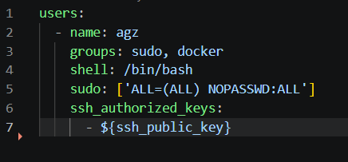
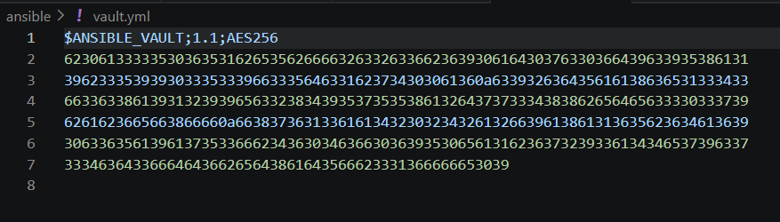
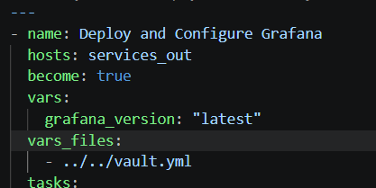
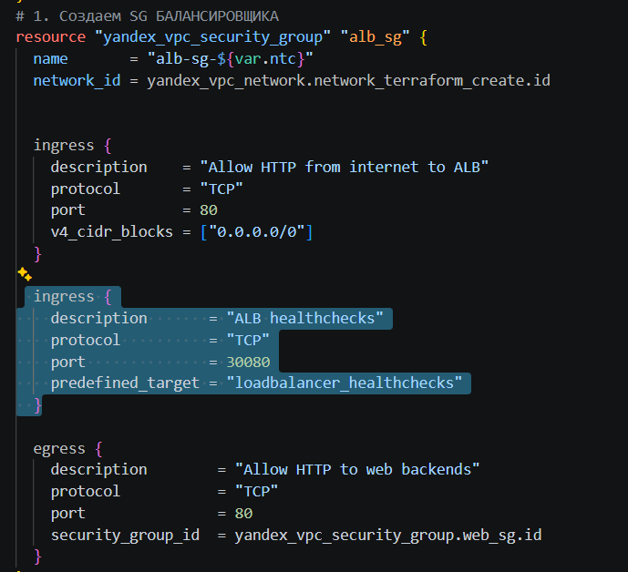
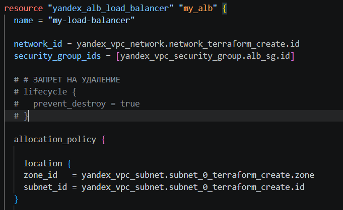
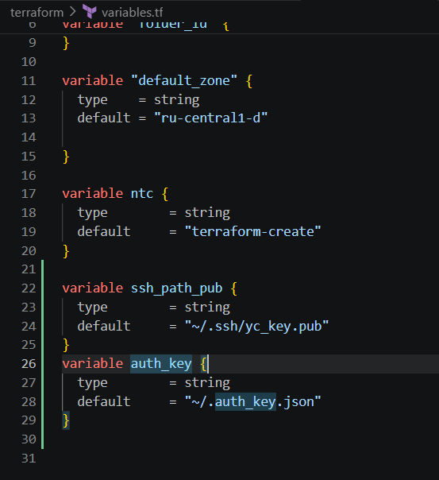
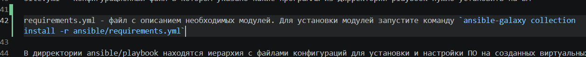
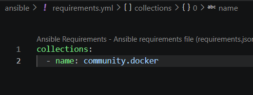
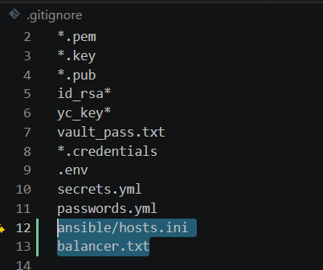

Перед зачётом нужно исправить несколько технических моментов.

1. Уберите опубликованные пароли.
Сейчас в cloud-init.yml находится пароль пользователя agz, а в grafana.yml — пароль администратора Grafana.


При этом Grafana доступна через публичный IP, поэтому пароль необходимо сменить и убрать из репозитория. Чувствительные значения лучше вынести, например, в Ansible Vault.


Для пользователя, который подключается по SSH-ключу, пароль в cloud-init вообще можно не задавать.

Дополните Security Group для Application Load Balancer.
Добавьте правило проверки состояния узлов ALB:


``` tf
ingress {
  description       = "ALB healthchecks"
  protocol          = "TCP"
  port              = 30080
  predefined_target = "loadbalancer_healthchecks"
}
```


Уберите prevent_destroy = true у ALB.
Сейчас у вас есть stop.sh, который выполняет:

```
terraform destroy
```

но Terraform не сможет полностью удалить инфраструктуру, пока для ALB используется:

```
lifecycle {
  prevent_destroy = true
}
```

Для учебного проекта этот параметр лучше убрать.



Исправьте пути к локальным ключам Terraform.
Сейчас используются:

```
file("~/.auth_key.json")
file("~/.ssh/yc_key.pub")
```

Лучше как минимум:

```
file(pathexpand("~/.auth_key.json"))
file(pathexpand("~/.ssh/yc_key.pub"))
```

Ещё лучше — вынести эти значения в переменные, чтобы проект не был привязан к конкретным именам файлов на вашей машине.



Добавьте зависимости Ansible.
Playbook’и используют модули из community.docker, поэтому добавьте:

```
# ansible/requirements.yml
---
collections:
  - name: community.docker

  ```

И в README:


```
ansible-galaxy collection install -r ansible/requirements.yml
```



Уберите из Git автоматически генерируемые файлы.
Сейчас ansible/hosts.ini и balancer.txt содержат IP текущего стенда, хотя они формируются автоматически.

Добавьте их в .gitignore:


```
ansible/hosts.ini
balancer.txt
```



и удалите уже отслеживаемые файлы:

```
git rm --cached ansible/hosts.ini balancer.txt
```

Из дополнительных рекомендаций:

можно сильнее ограничить Security Groups, особенно публичный доступ к Grafana и Kibana;
убрать лишнюю пустую группу [prometheus] из inventory;
закрепить конкретные версии Docker-образов вместо latest.
Сама архитектура и реализованные сервисы выглядят хорошо, переделывать их не требуется.

После перечисленных исправлений работу можно будет принять.

